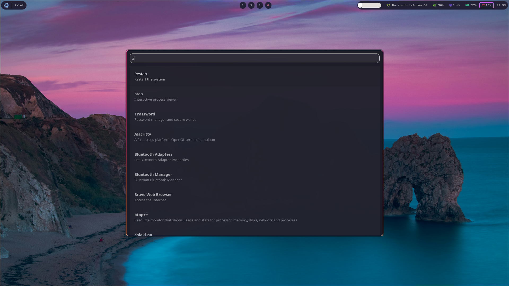

# Palet - GTK4 Application Launcher

**Disclaimer**: A lot of this was done with the help of Claude, hence not everything is optimal. Especially not command launching. This is still really beta software make sure to investigate the code before.

A fast, modern application launcher built with GTK4 and Rust. Palet provides instant application search, custom commands with argument support, arithmetic evaluation, and configurable styling.



## Features

- **Fast Application Search**: Instant search through installed applications
- **Custom Commands**: Define your own commands with optional argument support
- **Terminal Integration**: Commands can run in configurable terminal emulator
- **Arithmetic Evaluation**: Built-in calculator for quick math
- **Web Search Fallback**: Search the web when no local results found
- **Configurable**: Customize dimensions, styling, terminal, and search URLs
- **Keyboard Navigation**: Full keyboard control with arrow keys and Enter
- **Auto-scroll**: List automatically scrolls to keep selection visible
- **CSS Styling**: Fully customizable appearance via CSS

## Installation

### Using Nix Flakes (Recommended)

#### For NixOS Users

Add the flake to your NixOS configuration:

```nix
{
  inputs = {
    nixpkgs.url = "github:NixOS/nixpkgs/nixos-unstable";
    palet.url = "github:user/palet";  # Replace with your repo URL
  };

  outputs = { nixpkgs, palet, ... }: {
    nixosConfigurations.yourhostname = nixpkgs.lib.nixosSystem {
      system = "x86_64-linux";
      modules = [
        palet.nixosModules.default
        {
          programs.palet = {
            enable = true;
            settings = {
              width = 800;
              height = 600;
              terminal = "alacritty -e";
              
              custom_commands = {
                htop = {
                  name = "htop";
                  command = "htop";
                  description = "System monitor";
                  tty = true;
                };
                
                shutdown = {
                  name = "Shutdown";
                  command = "systemctl poweroff";
                  description = "Power off the system";
                };
              };
            };
          };
        }
      ];
    };
  };
}
```

#### For Non-NixOS Users

```bash
# Install directly from flake
nix profile install github:user/palet

# Or build and run locally
nix run github:user/palet
```

### Building from Source

```bash
# Clone the repository
git clone https://github.com/user/palet
cd palet

# Using Nix (recommended)
nix develop  # Enter development shell
cargo build --release

# Using system Rust (requires GTK4 development libraries)
cargo build --release
```

## Configuration

Palet looks for configuration in `~/.config/palet/config.toml`. Here's a complete example:

```toml
# Window dimensions
width = 700
height = 700

# Text input placeholder
placeholder = "Type here..."

# Search URL template (use {q} for query placeholder)
search_url = "https://duckduckgo.com/?q={q}"

# Terminal command to use for tty commands
terminal = "alacritty -e"

# Custom commands
[custom_commands.sleep]
name = "Sleep"
command = "systemctl suspend"
description = "Put the system to sleep"

[custom_commands.lock]
name = "Lock Screen"
command = "loginctl lock-session"
description = "Lock the current session"

[custom_commands.shutdown]
name = "Shutdown"
command = "systemctl poweroff"
description = "Power off the system"

[custom_commands.htop]
name = "htop"
command = "htop"
description = "Interactive process viewer"
tty = true

[custom_commands.vim]
name = "vim"
command = "vim"
description = "Text editor"
accepts_arguments = true
tty = true

[custom_commands.man]
name = "man"
command = "man"
description = "Show manual page"
accepts_arguments = true
tty = true
```

### Custom Commands

Custom commands support several options:

- **`accepts_arguments`**: If `true`, command can receive arguments
  - Example: `vim ~/.bashrc` runs `vim ~/.bashrc`
  - Commands stay visible as long as the name is present
- **`tty`**: If `true`, command runs in terminal
  - Uses the configured `terminal` command
  - Example: `htop` becomes `alacritty -e htop`
- **`description`**: Optional description shown in results

### CSS Styling

Create `~/.config/palet/style.css` to customize appearance:

```css
/* Custom styling example */
.app-entry {
    margin: 16px;
    padding: 12px;
    border-radius: 8px;
}

.custom-command {
    color: #ff6b6b;
    font-weight: bold;
}

.app-name {
    font-size: 1.1em;
}
```

## Usage

### Basic Usage
- Type to search applications and commands
- Use arrow keys to navigate results
- Press Enter or click to launch
- Press Escape to close

### Examples
- `firefox` - Launch Firefox browser
- `vim ~/.bashrc` - Edit .bashrc in vim (if vim command configured)
- `man ls` - Show manual page for ls command
- `2 + 2` - Calculate arithmetic (shows result)
- `random text` - Falls back to web search

### Keyboard Shortcuts
- **Arrow Keys**: Navigate through results
- **Enter**: Launch selected item
- **Escape**: Close launcher
- **Tab**: Auto-complete (future feature)

## Development

```bash
# Enter development environment
nix develop

# Run in development mode
cargo run

# Run tests
cargo test

# Build release version
cargo build --release

# Check flake
nix flake check

# Build with nix
nix build
```

### Dependencies
- GTK4
- GLib
- Cairo
- Pango
- Rust 1.75+

## Architecture

- **Main App** (`src/main.rs`): GTK4 UI and event handling
- **Application Scanner** (`src/apps.rs`): Desktop file parsing and filtering
- **Configuration** (`src/config.rs`): TOML config loading and defaults
- **NixOS Module** (`nixos-module.nix`): System-wide installation support

## Contributing

1. Fork the repository
2. Create a feature branch
3. Make your changes
4. Test with `nix develop` and `cargo test`
5. Submit a pull request

## License

MIT License - see LICENSE file for details.

## Acknowledgments

- Built with [GTK4](https://gtk.org/) and [Rust](https://rust-lang.org/)
- Inspired by application launchers like Albert, Ulauncher, and Rofi
- Uses [Nix flakes](https://nixos.wiki/wiki/Flakes) for reproducible builds
